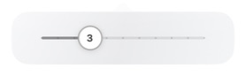

<div align="center">

# ∞ RewriteBar

**Your words. A little clearer.**

Select text. Press **⌥R**. Keep writing.

A tiny Mac menu bar app with one slider and one shortcut.

[Download](https://github.com/Nexus-Global-Partners/RewriteBar/releases/latest) · [Source](https://github.com/Nexus-Global-Partners/RewriteBar) · [Report an issue](https://github.com/Nexus-Global-Partners/RewriteBar/issues)

</div>



## How it works

1. Select text in a compatible editable field.
2. Press **Option R**. RewriteBar revises the selection and copies the result.
3. Keep writing. A small indicator in the menu bar shows progress and completion.

Click **∞** to change intensity from **0** (proofread) to **10** (rephrase completely while preserving meaning). The slider closes when you finish adjusting it and returns you to your editor. Your chosen level applies to following shortcuts until you quit or choose **Use default**.

Right-click **∞** for **Settings**. Save your default intensity, record another shortcut, connect your account, and optionally add writing preferences. Defaults start at level **3**. Press the shortcut again during a rewrite to cancel.

## Install

Requires an Apple Silicon Mac, macOS 14 or newer, a current official [Codex app](https://chatgpt.com/codex), an eligible ChatGPT account with Codex access, and internet connectivity.

> Version 2 is being prepared in [the release pull request](https://github.com/Nexus-Global-Partners/RewriteBar/pull/5). The latest published release may still be version 1. To try version 2 before publication, build the `codex/luna-online-rewrites` branch using the development instructions below.

For a published release, install or update with:

```sh
curl -fsSL https://raw.githubusercontent.com/Nexus-Global-Partners/RewriteBar/main/Scripts/install-release.sh | zsh
```

The installer verifies the download checksum and app signature, installs to `~/Applications`, and opens RewriteBar. Public builds are ad hoc signed, not Apple notarized.

Open Settings, connect your ChatGPT account, and allow RewriteBar in **System Settings → Privacy & Security → Accessibility**. Enable **Open at login** if you want it always ready.

## Small by design

* One slider, one shortcut, no permanent Dock icon.
* Native Swift and SwiftUI, with no third-party Swift dependencies or bundled model weights.
* Codex Luna through your ChatGPT subscription, with no API key to manage.
* A persistent connection and cached account readiness reduce repeated setup work.
* Rewrites preserve facts, uncertainty, language, quoted text, voice, paragraphs, and lists. Styles and custom instructions remain subordinate to those rules.

Speed depends on the text, connection, and service load. Requests are limited to 2,000 visible characters and an 18-second deadline. Larger model downloads and offline fallback are not part of version 2.

## Your text, deliberately handled

Text is accessed only after the shortcut. Selected text and enabled writing preferences are sent to OpenAI for that rewrite. RewriteBar keeps no rewrite history and has no telemetry or analytics. OpenAI's account terms and data controls still apply.

The app uses a separate Codex sign-in area, temporary threads, structured output, and a restricted official runtime with model tools disabled. It never borrows your normal Codex projects, settings, or credentials. See [the security policy](SECURITY.md).

A result replaces text only if the original app, field, and selected range still match. If you move away, the completed result is copied and the menu bar says **Copied**. Password fields are refused. Some editors do not expose editable selections to macOS Accessibility and are unsupported.

## Build and contribute

Requires Swift 6.1 or newer. No model download is needed.

```sh
git clone --branch codex/luna-online-rewrites https://github.com/Nexus-Global-Partners/RewriteBar.git
cd RewriteBar
./Scripts/check-project.sh
./Scripts/install.sh
```

Read [AGENTS.md](AGENTS.md) for the product contract, architecture, and verification workflow. [CONTRIBUTING.md](CONTRIBUTING.md) covers pull requests; [RELEASING.md](RELEASING.md) covers public releases.

## Share

Download the [untouched slider screenshot](BrandAssets/rewritebar-slider.png) or the larger [1536 × 1024 social image](BrandAssets/rewritebar-social.png), styled from that capture for LinkedIn and X. No personal text, account details, or desktop clutter appears in either image.

[MIT license](LICENSE) · Built by Nexus Global Partners
