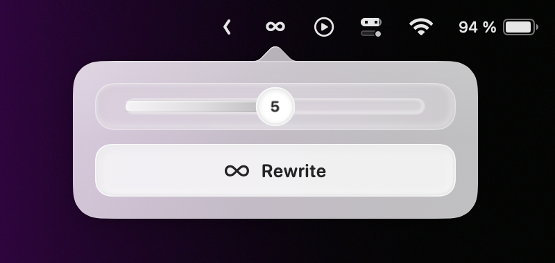

<p align="center">
  
</p>

<h1 align="center">RewriteBar</h1>

<p align="center">A private, native macOS writing tool that rewrites from the menu bar or directly from your keyboard.</p>

<p align="center">
  
</p>

<p align="center">
  <a href="#install">
    
  </a>
</p>

<p align="center">
  <a href="https://github.com/Nexus-Global-Partners/RewriteBar/actions/workflows/ci.yml"></a>
  <a href="https://github.com/Nexus-Global-Partners/RewriteBar/releases/latest"></a>
  <a href="LICENSE"></a>
</p>

RewriteBar gives you two focused paths. Rewrite clipboard text from its compact menu bar control, or select editable text in another app and use a keyboard shortcut. Everything runs on your Mac through MLX. There is no account, API key, server, telemetry, analytics, or runtime network access.

## Product idea

RewriteBar explores a different approach to writing software. The tool should meet you where you already write instead of pulling you into another editor, tab, or conversation.

The model is local, open, offline, and specialized around one task. The interface stays deliberately small. Personalization exists, but it lives behind a native Settings window rather than inside the main interaction.

Extreme minimalism here does not mean removing useful capability. It means reducing the distance between intent and result:

1. Select or copy the text.
2. Choose how strongly it may change.
3. Rewrite once.
4. Continue writing.

## Install

Requires an Apple Silicon Mac with macOS 14 or newer.

The recommended installation verifies the release checksum and avoids the browser quarantine warning applied to direct downloads:

```sh
curl -fsSL https://raw.githubusercontent.com/Nexus-Global-Partners/RewriteBar/main/Scripts/install-release.sh | zsh
```

You can also download `RewriteBar.zip` from the [latest release](https://github.com/Nexus-Global-Partners/RewriteBar/releases/latest), expand it, and move the app to Applications. Browser downloads are quarantined by macOS.

The public build is ad hoc signed, not notarized with an Apple Developer ID. If macOS blocks a manually downloaded copy, open System Settings, choose Privacy & Security, then select Open Anyway for RewriteBar. Only do this for the checksum verified release from this repository.

## Update

Rerun the same verified command whenever a new release is available:

```sh
curl -fsSL https://raw.githubusercontent.com/Nexus-Global-Partners/RewriteBar/main/Scripts/install-release.sh | zsh
```

It replaces the existing copy in `~/Applications`, verifies the signature, and opens the current release. RewriteBar performs no background update checks, so the running app remains fully local and network free.

## Use from the menu bar

1. Copy text in any app.
2. Click the infinity icon in the menu bar.
3. Choose an intensity from 0 through 10.
4. Press Rewrite.
5. The finished rewrite is copied automatically, then the popover closes.

The slider becomes a minimal progress rail while RewriteBar works. Preparation occupies only the beginning of the rail. Once generation starts, progress follows the text actually produced by the model. When the rewrite is copied, the button briefly confirms Copied to Clipboard with a checkmark. A subtle curved arrow lets you restore the previous clipboard entry until you copy something else.

The slider controls how much RewriteBar changes. Each number has a defined contract:

* 0 only fixes obvious spelling, grammar, and punctuation errors.
* 1 makes essential corrections and very small clarity changes.
* 2 lightly improves grammar, flow, and readability.
* 3 gently rewrites awkward sentences without changing tone or meaning.
* 4 moderately rewrites unclear or repetitive parts.
* 5 freely improves wording, flow, and organization while preserving the message.
* 6 noticeably restructures sentences and paragraphs where useful.
* 7 substantially reworks most of the text while preserving intent.
* 8 uses significant freedom in wording, tone, and structure.
* 9 rebuilds the text almost entirely from its essential message and details.
* 10 creates the strongest new version of the same idea with maximum structural freedom.

## Rewrite selected text

The default shortcut is `Command R`.

1. Right click the infinity icon and open Settings.
2. Allow RewriteBar in macOS Accessibility settings.
3. Choose the shortcut intensity, writing style, and keyboard shortcut you prefer.
4. Select editable text in another app.
5. Press the shortcut.

The infinity icon becomes a small progress indicator while the local model works. A checkmark confirms that the selection was rewritten and the result was copied. If the focused field or selection changes before completion, RewriteBar leaves the text untouched and keeps a successfully generated result on the clipboard.

The direct replacement path works in applications that expose a writable text selection through macOS Accessibility. Unsupported custom editors fail safely without simulating copy and paste or changing another field.

## Settings

Right click the infinity icon and choose Settings. You can configure:

* Shortcut intensity, with level 3 as the initial default
* RewriteBar, Clear, Professional, Conversational, or Persuasive writing style
* Any available keyboard shortcut using Command, Control, or Option
* Optional custom writing instructions, either added to the selected style or used exclusively
* macOS Accessibility permission for selected text replacement

Custom instructions save automatically as you type. By default, they add to the selected writing style. Turn on Exclusive to ignore the selected style and use only your custom instructions for presentation. Intensity and all source preservation rules still apply in both modes. Common preferences such as sentence length, directness, warmth, contractions, lowercase presentation, regional spelling, and punctuation are turned into explicit writing cues for the local model. RewriteBar applies compatible preferences while ignoring requests that would invent facts, remove uncertainty, translate the source, change terminology, or alter meaning.

Every style and custom preference remains subordinate to the source. RewriteBar must preserve truth, meaning, intent, uncertainty, language, important details, approximate length, tone of voice, and the recognizable style of the original writer. It rejects artificial filler, corporate language, sentence fragments, and dash characters.

## Privacy

The Qwen3 1.7B model is bundled inside each release and runs in process with MLX. Clipboard and selected text are never sent over the network, displayed in the app, logged, or saved. RewriteBar stores only local preferences: the last menu intensity, shortcut intensity, writing style, shortcut, optional custom instructions, and whether those instructions are additive or exclusive.

Accessibility access is used only when the configured shortcut asks RewriteBar to read and replace the current editable selection. Secure text fields are refused. Before replacement, RewriteBar verifies that the application, focused element, and exact selected range are still the same. This keeps replacement safe while supporting dynamic editors that normalize selected text during generation.

## Build from source

```sh
git clone https://github.com/Nexus-Global-Partners/RewriteBar.git
cd RewriteBar
./Scripts/download-model.sh
./Scripts/install.sh
```

`download-model.sh` downloads the exact model files used by the release and verifies every checksum before installation. Model weights and generated app bundles are intentionally excluded from Git. The small Apple Silicon MLX runtime library is pinned and checksum verified in the repository so clean release builds are reproducible.

Useful development commands:

```sh
swift build
./Scripts/test.sh
swift run RewriteCoreChecks
./Scripts/build-app.sh
./Scripts/package-release.sh
```

`Scripts/test.sh` runs the standard unit and integration suite. `RewriteCoreChecks` provides an additional fast policy gate. The opt in `RewriteBenchmark` executable evaluates all eleven intensities against varied writing, fidelity, structure, safety, and latency cases using the real bundled model.

## Try it

### Light cleanup at level 3

```text
hey sorry i didnt reply sooner ive been busy moving and everything took longer then i expected. i should be able to send the files tomorrow morning but if not it will be around lunch, hope thats okay and thanks for being patient
```

### Team update at level 5

```text
Hey everyone, just wanted to touch base on the launch because we still dont have a final date. Some folks think Friday while others think next week. The onboarding flow looks better but the permissions screen is still confusing support got 18 questions yesterday. Maybe we should delay but im not totally sure. Please send your status and blockers by 4pm so we can decide today.
```

### Technical note at level 8

```text
API latency went from 180 ms to 640 ms between 09:10 and 09:35 UTC only in eu west 1. we dont know the cause yet but connection pool exhaustion after version 2.4.1 is the strongest guess because rolling back three instances reduced p95 latency around 38%. errors stayed below 0.7%, no data loss was found, and the US region wasnt affected. next we need to compare pool saturation before deciding if the remaining instances should be rolled back.
```

## Architecture

* `RewriteCore` handles validation, all eleven intensity contracts, writing styles, prompt construction, source instruction protection, meaning checks, and safe output cleanup.
* `RewriteEngine` gives the menu and shortcut paths one normalized, bounded generation interface.
* `GenerationArbiter` serializes access to the local model and removes cancelled work from the queue.
* `LocalModelService` loads the bundled model, generates text, validates meaning signals, and falls back safely if a model result changes a protected fact or relationship.
* `RewriteViewModel` owns rewrite, progress, automatic copy, restore, and failure states.
* `SelectedTextRewriteCoordinator` owns the shortcut rewrite lifecycle and safe replacement.
* `AccessibilitySelectionClient` captures and verifies editable selections without simulated keyboard input.
* `RewriteSettingsStore` keeps preferences local and `SettingsView` provides the native settings experience.
* AppKit owns the persistent menu bar item, global shortcut, status feedback, and popover lifecycle. SwiftUI provides the compact content, VoiceOver labels, and adaptive materials.

RewriteBar is designed for messages, emails, and short passages. Inputs longer than 2,000 visible characters are rejected immediately so both interactions stay responsive and predictable. Accepted generation is deterministic, bounded to 18 seconds, and configured with thinking disabled.

## Contribute

Bug reports, feature ideas, and pull requests are welcome. Read [AGENTS.md](AGENTS.md) for the product contract and [CONTRIBUTING.md](CONTRIBUTING.md) for the shortest path to a useful pull request. Use [GitHub Issues](https://github.com/Nexus-Global-Partners/RewriteBar/issues) for actionable reports and [GitHub Discussions](https://github.com/Nexus-Global-Partners/RewriteBar/discussions) for questions and early ideas.

Maintainers can follow [RELEASING.md](RELEASING.md) to validate, tag, publish, and verify an update with one guarded command.

Please report security concerns using the private process in [SECURITY.md](SECURITY.md).

## License

RewriteBar source is available under the [MIT License](LICENSE). Qwen3 model weights are distributed under Apache 2.0. MLX Swift and MLX Swift LM retain their upstream MIT licenses.
