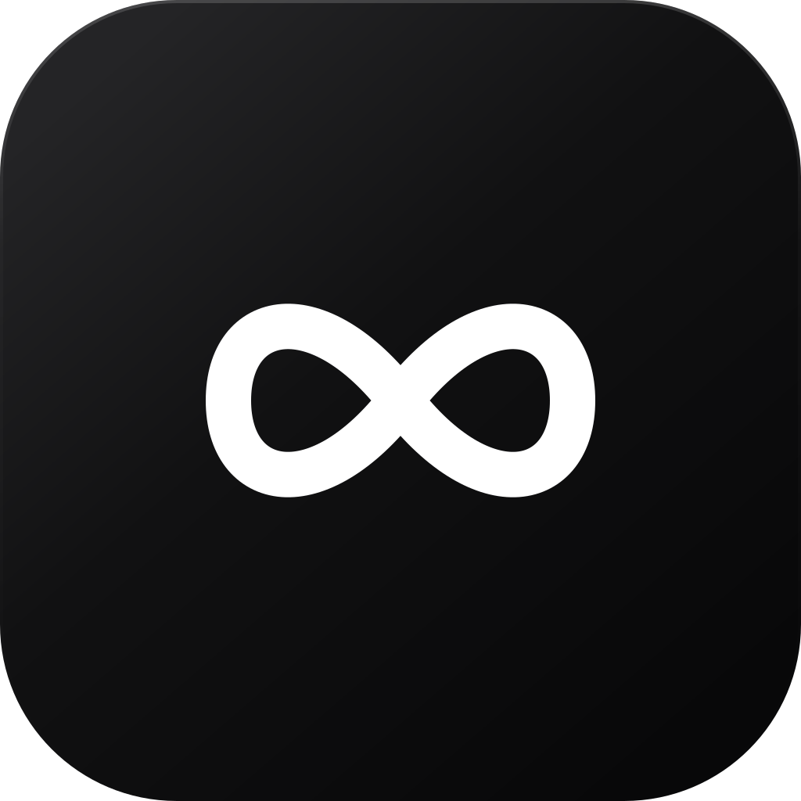

<p align="center">
  
</p>

<h1 align="center">RewriteBar</h1>

<p align="center">A private, native macOS menu bar app that rewrites clipboard text with a local model.</p>

<p align="center">
  <a href="https://github.com/Nexus-Global-Partners/RewriteBar/actions/workflows/ci.yml"></a>
  <a href="https://github.com/Nexus-Global-Partners/RewriteBar/releases/latest"></a>
  <a href="LICENSE"></a>
</p>

RewriteBar reads plain text from the clipboard only when you press Rewrite. Everything runs on your Mac through MLX. There is no account, API key, server, telemetry, or analytics.

## Install

Requires an Apple Silicon Mac with macOS 14 or newer.

```sh
curl -fsSL https://raw.githubusercontent.com/Nexus-Global-Partners/RewriteBar/main/Scripts/install-release.sh | zsh
```

You can also download `RewriteBar.zip` from the [latest release](https://github.com/Nexus-Global-Partners/RewriteBar/releases/latest), expand it, and move the app to Applications.

The public build is ad hoc signed, not notarized with an Apple Developer ID. If macOS blocks the first launch, Control click RewriteBar in Finder, choose Open, then confirm Open.

## Use

1. Copy text in any app.
2. Click the infinity icon in the menu bar.
3. Choose an intensity from 0 through 10.
4. Press Rewrite.
5. Press Copy Rewrite when the result is ready.

The popover closes after copying. A subtle curved arrow lets you restore the previous clipboard entry until you copy something else.

The slider controls how much RewriteBar changes:

* 0 preserves the original almost exactly and fixes clear mistakes.
* 3 is the default for a light, natural cleanup.
* 5 improves structure and clarity while preserving the writer's voice.
* 10 allows the strongest restructuring without changing facts or intent.

## Privacy

The Qwen3 1.7B model is bundled inside each release and runs in process with MLX. Clipboard text is never sent over the network, displayed in the app, logged, or saved. RewriteBar stores only the selected intensity.

## Build from source

```sh
git clone https://github.com/Nexus-Global-Partners/RewriteBar.git
cd RewriteBar
./Scripts/download-model.sh
./Scripts/install.sh
```

`download-model.sh` downloads the exact model files used by the release and verifies every checksum before installation. Model weights and generated app bundles are intentionally excluded from Git. The small Apple Silicon MLX runtime library is pinned and checksum verified in the repository so clean release builds are reproducible.

Useful development commands:

```sh
swift build
swift run RewriteCoreChecks
./Scripts/build-app.sh
./Scripts/package-release.sh
```

## Try it

### Light cleanup at level 3

```text
hey sorry i didnt reply sooner ive been busy moving and everything took longer then i expected. i should be able to send the files tomorrow morning but if not it will be around lunch, hope thats okay and thanks for being patient
```

### Team update at level 5

```text
Hey everyone, just wanted to touch base on the launch because we still dont have a final date. Some folks think Friday while others think next week. The onboarding flow looks better but the permissions screen is still confusing support got 18 questions yesterday. Maybe we should delay but im not totally sure. Please send your status and blockers by 4pm so we can decide today.
```

### Technical note at level 8

```text
API latency went from 180 ms to 640 ms between 09:10 and 09:35 UTC only in eu west 1. we dont know the cause yet but connection pool exhaustion after version 2.4.1 is the strongest guess because rolling back three instances reduced p95 latency around 38%. errors stayed below 0.7%, no data loss was found, and the US region wasnt affected. next we need to compare pool saturation before deciding if the remaining instances should be rolled back.
```

## Architecture

* `RewriteCore` handles validation, prompt construction, and safe output cleanup.
* `LocalModelService` loads the bundled model, generates text, and supports cancellation.
* `RewriteViewModel` owns the manual rewrite, copy, undo, and failure states.
* SwiftUI provides the compact `MenuBarExtra`, keyboard access, VoiceOver labels, and light and dark materials.

Inputs longer than 20,000 visible characters are rejected to keep latency and memory predictable. Generation is deterministic, bounded, and configured with thinking disabled.

## Contribute

Bug reports, feature ideas, and pull requests are welcome. Read [CONTRIBUTING.md](CONTRIBUTING.md) before making a change. Use [GitHub Issues](https://github.com/Nexus-Global-Partners/RewriteBar/issues) for actionable reports and [GitHub Discussions](https://github.com/Nexus-Global-Partners/RewriteBar/discussions) for questions and ideas.

Please report security concerns using the private process in [SECURITY.md](SECURITY.md).

## License

RewriteBar source is available under the [MIT License](LICENSE). Qwen3 model weights are distributed under Apache 2.0. MLX Swift and MLX Swift LM retain their upstream MIT licenses.
